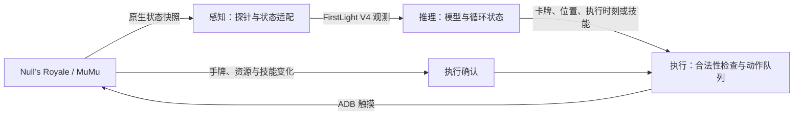

# CR_fighting_pipeline

**在 Windows 上让 FirstLight 的《皇室战争》模型真实打在线对战。**

Deploy FirstLight CR models onto a Root MuMu running Null’s Royale: read native state,
decide, deploy cards by touch, confirm the result, and loop the matches.

当前版本：**`v0.1.0-preview`**。状态与已知边界见[验证记录](docs/VALIDATION.md)。
感知来自原生数据，视觉感知是后续方向；接入目标是 Null’s Royale，未适配官方客户端。

[这个仓库做什么](#这个仓库做什么) · [获取方式](#获取方式) · [开始使用](#开始使用) · [模型与权重](docs/MODELS.md) · [配置指南](docs/SETUP.md) · [架构说明](docs/ARCHITECTURE.md)

## 这个仓库做什么

一句话：**把已经训练好的 FirstLight 模型接到真实联机对局里，让它自己读战况、自己下牌，
并把一局接一局地跑下去。**

模型要跑起来，中间有三个必须打通的环节，缺一个都动不了：

1. **读状态**——游戏跑在 MuMu 里，模型要的却是 FirstLight 的 V4 观测格式。
   仓库用一个原生代理探针从游戏进程里只读采集实时状态，再转换成模型能吃的观测。
2. **做决策**——复用 FirstLight 已发布的 V4 权重，保留它的 LSTM 状态、上一动作历史和每 5 tick 的决策窗口。
3. **执行并确认**——把决策换算成屏幕坐标，通过 ADB 触摸选牌、下牌，
   再用**游戏自身状态的变化**（手牌变少、圣水下降、技能充能清零）确认动作真的生效。
   发送成功不算成功。

在这之上，`tools/multi_match.py` 把单局串成多局：结算页用天梯"再来一场"直接衔接下一局，
循环不需要人工点击；`tools/forever.py` 再往上包一层，把会话一直接下去，让它能整夜无人值守。
你自己的流水线可以继续在它们之上编排。

**它是部署端，不是训练端。** 模型架构、权重、观测与动作契约都来自上游 FirstLight CR；
本仓库不改权重、不训练、不微调，也不能重新导出权重。
**它也不是通用的《皇室战争》脚本**：没有图像识别，只支持指纹匹配的 Null’s Royale，不接官方客户端，
换版本需要重新适配。

来源说明：桥接与执行层（原生探针、观测适配、坐标换算、ADB 触摸与结果确认）是本仓库自己的实现，
重构自作者先前名为 **RoyaleHarness** 的工程；模型、观测与动作契约一侧来自上游
[FirstLight CR](https://gitlab.com/firstlight3/FirstLight_CR)，`upstream/firstlight/` 与 `weights/`
都是它的裁剪副本，逐文件来源与哈希见 [upstream.lock.json](upstream.lock.json) 与
[上游说明](probe/FIRSTLIGHT_NOTICE.md)。

## 获取方式

**两种渠道的内容不同，先确认拿到的是哪一种。**

| 渠道 | 包含 | 是否开箱即用 |
| --- | --- | --- |
| `git clone` 本仓库 | 源码 + `weights/`（5 个权重，约 231 MB）+ `upstream/firstlight/`（裁剪后的推理运行时与冻结目录数据） | 是。克隆后无需再访问上游仓库 |
| `tools/package_release.py` 产出的 ZIP | 仅 `SHA256SUMS.json` 列出的已审查源码、探针与文档 | 否。需另行准备权重与上游运行时 |

`weights/` 是真实二进制文件，不是 Git LFS 指针，克隆后直接可用。
打包渠道按设计不含 `weights/` 与 `upstream/`（打包工具拒绝 `.pt`），
用该渠道分发时请按 [upstream.lock.json](upstream.lock.json) 补齐这两个目录；
补齐后两种渠道的运行方式完全一致。详见[发布说明](docs/RELEASE.md)。

## 让 agent 协助配置

在支持仓库指令的编程助手中打开项目，可以这样提出任务：

> 请阅读 AGENTS.md，帮我把这个项目配置到我指定的 MuMu 实例。
> 按配置技能发现环境、填写本地设置并验证运行；需要我进入对战时告诉我。

[AGENTS.md](AGENTS.md) 是工作入口，
[配置技能](.agents/skills/configure-cr-fighting-pipeline/SKILL.md) 说明如何识别实例、选择端口、
填写路径与账号、校准并验证闭环。是否自动发现技能取决于助手；不能自动加载时，直接让它阅读这些文件即可。
这些文件提供操作指引，不会自行执行配置。

## 项目如何工作



| 层级 | 当前实现 | 主要职责 |
| --- | --- | --- |
| 感知 | 原生只读探针与 Python 适配器 | 读取实时状态，核对对象身份、席位、坐标及关系，转换为模型观测 |
| 推理 | FirstLight V4 与冻结权重 | 保留 LSTM、动作历史、每 5 tick 决策窗口和顺序微动作 |
| 执行 | ADB / Android 触摸输入 | 选牌、下牌、已支持英雄的技能点击，检查时效并等待结果确认 |

动作通过触摸执行，后台探针只负责状态获取与执行观测。本项目复用已有权重，不含新模型训练流程；
运行不需要 `IL_Replay` 数据集，也不需要安装离线训练引擎或 Clash-Royale-Battle-Engine。

**本仓库是自包含部署端**：FirstLight 推理运行时与冻结卡牌数据已裁剪内置于
`upstream/firstlight/`，全部模型权重位于 `weights/`。
训练端不随本仓库分发，来源与逐文件哈希见 [upstream.lock.json](upstream.lock.json) 与
[上游说明](probe/FIRSTLIGHT_NOTICE.md)。

## 仓库结构

```text
agent/                 推理层：观测投影、模型加载与动作解码、动作队列与确认
bridge/                桥接层：探针客户端、坐标换算、各状态投影器、ADB 执行器
probe/                 原生探针源码、稳定构建产物、构建与安装／恢复脚本
tools/                 检查、校准、采集、多局自动化与打包工具
upstream/firstlight/   裁剪后的 FirstLight 推理运行时与冻结目录数据（只读，勿改）
weights/               随仓库分发的 5 个模型权重
docs/                  安装、模型、架构、校准、验证与发布说明
main.py                单局／自动对战入口
start_agent.bat        启动菜单
```

机器相关配置写入被忽略的 `settings.local.json` 与 `ability_calibration.local.json`，
不进入版本控制。

## 当前能力

- **实时自动下牌**：将观测送入原模型，把决策转换为屏幕操作，并跟踪执行结果。
- **坐标与席位适配**：处理模型格子、原生世界坐标和屏幕位置之间的转换，提供地面校准与核对工具。
- **战况输入**：接入手牌与循环、单位与塔、持续效果、攻击目标、部分投射物与战斗状态。
- **部署分组**：根据已验证来源关联同次部署的成员，支持不同批次分组和阵亡后的成员减少。
- **特殊形态**：重点覆盖英雄火枪手的部署与单按钮技能、觉醒小骷髅和觉醒加农炮。
- **自动表情**：`--emote` 按随机间隔发送表情；只在执行器空闲时发，不进入动作队列，
  失败只停用本局表情。默认关闭，随附模板把间隔设为实测甜点区间 3.5–5 秒。见[自动表情](docs/EMOTE.md)。
- **无人值守长跑**：`tools/forever.py` 在有界多局监督器之上反复起会话，日志按份数轮转、
  哨兵文件随时停止、连续空局自动退避，适合整夜挂机。
- **运行与排错**：提供只观察模式、遥测记录、离线回放比较、启动检查、稳定探针安装与恢复。

实现细节见[架构说明](docs/ARCHITECTURE.md)。

## 模型与权重

`weights/` 内是 FirstLight CR 发布的 5 个权重，启动菜单按名称选择，说明见[模型与权重](docs/MODELS.md)。

| 菜单选项 | 别名 | 适合的卡组 |
| --- | --- | --- |
| 速猪 specialist2（默认） | `hog26` | 速猪（参考卡组） |
| 速猪 specialist1（对照） | `hog26_proactive` | 速猪 |
| 通用模型 | `general` | 混合卡组 |
| 模仿学习模型 | `il` | 混合卡组 |
| 模仿学习模型 | `active_il` | 混合卡组 |

速猪参考卡组为：**野猪骑士、火枪手、小骷髅、冰人、冰精灵、加农炮、火球、滚木**
（其中火枪手为英雄形态，加农炮与小骷髅为觉醒形态）。

**换模型不等于扩大支持范围。** 权重决定策略偏好，能否执行某张卡的形态与技能由桥接层决定；
使用非速猪卡组时另选合适权重，并先确认当前卡牌与形态的支持情况。

## 支持范围

- Null’s Royale **15.535.13**（`nullsroyale.rel.free`，arm64-v8a），已启用 Root 和 ADB 的 MuMu 模拟器 12。
- 游戏 `libg.so` SHA-256 必须为
  `110aa2b5cac391c498645e072b0d88729428c2c2845e7e2737ca8ee979059783`，
  版本号相同不保证二进制或内容相同；安装器会核对，不匹配就停止。
  完整的构建指纹（含 APK 与资源版本）见
  [`upstream/firstlight/native_runner/supported_engine.json`](upstream/firstlight/native_runner/supported_engine.json)。
- 默认 `device: cuda:0` 需要 NVIDIA 显卡与支持 CUDA 12.8 的驱动；也可改用 CPU。
- 参考屏幕布局为竖屏 1080×1920，其他布局需要重新校准。
- 已重点实机验证速猪及英雄火枪手、觉醒小骷髅、觉醒加农炮。
- General 使用完整目录；可执行的卡牌形态、英雄技能与塔兵状态取决于桥接层的支持范围。
- 默认 `reference` 输入基线；`extended` 为精确事件对照实验。完整创建链实验未作为默认功能发布。

需要自备的东西与安装步骤见[安装、配置与排错](docs/SETUP.md)，
架构边界见[架构与边界](docs/ARCHITECTURE.md)、[验证记录](docs/VALIDATION.md)。

## 开始使用

准备 Windows（默认走 CUDA 时需要 NVIDIA 显卡）、Python 3.12、启用 Root 和 ADB 的 MuMu 模拟器 12，
以及构建指纹匹配的 Null’s Royale 安装包（需自备，本项目不分发）。
FirstLight 推理运行时、冻结目录数据与模型权重已随本仓库分发，无需单独准备。
逐项清单与"不需要装什么"见[安装、配置与排错](docs/SETUP.md)。

### 换机快速开始（三步）

在新电脑上从零到自动对战：

1. **装环境**：安装 [Python 3.12](https://www.python.org/downloads/)（勾选 Add to PATH）与
   [MuMu 模拟器 12](https://mumu.163.com/)（设置里启用 Root 与 ADB），安装匹配指纹的 Null's Royale；
   然后在仓库目录运行 `powershell -ExecutionPolicy Bypass -File .\setup.ps1` 创建运行环境。
2. **填设置**：复制 `settings.example.json` 为 `settings.local.json`，填入你的 ADB 路径与实例地址；
   在 AI 未启动时手动开一局，用 `tools\inspect_players.py` 确认账号并填入 `account_id`，
   用 `tools\coordinate_view.py` 核对地面坐标后把 `calibration_verified` 设为 `true`。
3. **装探针并开战**：运行 `powershell -ExecutionPolicy Bypass -File .\probe\deploy_probe.ps1` 安装稳定探针（会重启游戏），
   然后双击 `start_agent.bat` 选择运行方式；多局自动化用：

   ```powershell
   # 连续多局（天梯结算页用"再来一场"直接衔接下一局）
   .venv\Scripts\python.exe tools\multi_match.py --matches 50 --checkpoint hog26 --rematch

   # 无人值守长跑（表情默认开启，日志轮转，local\STOP_FOREVER 停止）
   .venv\Scripts\python.exe tools\forever.py --checkpoint hog26

   # 单局观察（不下牌，验证链路）
   .venv\Scripts\python.exe main.py --checkpoint hog26 --dry-run --once
   ```

也可以让编程助手代做以上全部：见下节"让 agent 协助配置"。

### 手动配置

按 [安装、配置与排错](docs/SETUP.md) 操作：

1. 运行 `setup.ps1` 安装项目 Python 环境。
2. 填写 `settings.local.json`，检查目标实例并安装稳定探针。
3. 在手动对局中确认账号，核对地面坐标和所需英雄按钮。
4. 双击 `start_agent.bat`，通过数字菜单选择运行方式、模型、特殊形态与输入方案。

完成首次配置后，日常使用只需打开模拟器与游戏，启动菜单，等待 AI 就绪后手动匹配。
配置、账号、校准、SDK 备份和运行日志保留在本地，不随发行包分享。

## 文档

- [安装、配置与排错](docs/SETUP.md)：依赖、参数、菜单、启动命令、恢复探针与常见问题。
- [原生探针](docs/PROBE.md)：感知层本身。钩子清单、安装与恢复、稳定产物与哈希、
  **模拟器更新后的失效诊断与重新适配**、修改探针必须遵守的不变量。
- [模型与权重](docs/MODELS.md)：5 个权重的来历、适用卡组与选择建议。
- [坐标核对](docs/CALIBRATION.md)：手牌、地面位置、英雄技能按钮与表情面板。
- [自动表情](docs/EMOTE.md)：开关、参数、校准、设计约束与实测行为。
- [架构与支持边界](docs/ARCHITECTURE.md)：感知、推理、执行及机制覆盖。
- [验证记录](docs/VALIDATION.md)：离线检查与真实对局证据。
- [发布说明](docs/RELEASE.md)：分发内容、文件校验和重新打包。

## 路线图

- [x] 原生感知 → 原模型推理 → 触摸执行闭环。
- [x] 建立默认输入基线与可选精确事件对照方案。
- [x] 整理便携配置、首次检查、稳定探针安装与恢复。
- [x] 分发自包含部署端：克隆后无需单独获取上游运行时与权重。
- [x] 补齐无人值守层：多局串联、长跑守卫与表情长跑节奏，均已实机验证。
- [x] 适配模拟器 ARM 转译器就地改写函数入口的情况（见[探针](docs/PROBE.md)）。
- [ ] 对当前支持卡组进行持续实战评估，区分执行问题和策略选择。
- [ ] 扩大英雄、觉醒和塔兵机制覆盖。
- [ ] 引入视觉感知、对象跟踪与状态估计，评估与现有模型输入的兼容性。

## 反馈与贡献

反馈问题时，请提供系统与 MuMu 版本、游戏指纹、屏幕尺寸、所选模型／输入方案、
简短复现步骤，以及出错前后的必要日志片段。分享前移除账号 ID、本机路径和其他个人信息。
涉及左右镜像或落点偏移时，请说明当时的卡牌、地面目标和实际落点。

新增机制应说明数据证据、模型字段映射和未知状态的处理方式；
行为变更需要相应回归测试，提交时请附上测试方法、结果和支持范围。

## 致谢与许可证

模型架构、权重、观测／动作合约和多项探针布局来自
[FirstLight CR](https://gitlab.com/firstlight3/FirstLight_CR)。
`CR_fighting_pipeline` 在此基础上提供面向当前在线测试环境的桥接与运行适配；
本发行版没有修改上游权重。

本项目采用 **Apache-2.0**，见 [LICENSE](LICENSE)、[NOTICE](NOTICE) 和
[上游来源说明](probe/FIRSTLIGHT_NOTICE.md)。随仓库分发的 `weights/` 为上游发布权重，
未作修改；原始游戏、SDK、APK、资源与对局不在此包内，需自备。
本项目与 Supercell、Null’s 和 MuMu 无隶属或背书关系，名称仅用于说明兼容对象。
