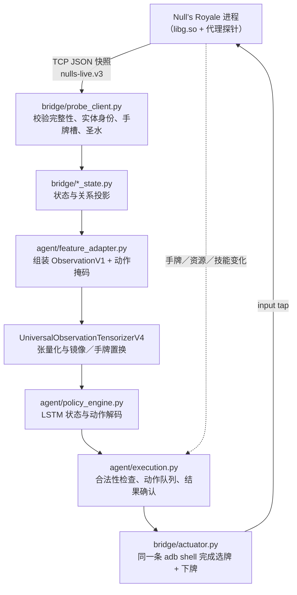

# 架构与当前边界

## 数据流

## 三层

1. **感知**：`probe` 在支持的游戏库上只读采集状态，`bridge` 校验身份、坐标、卡牌、持续效果、来源和时间。
   探针本身不做决策，也不改变游戏逻辑。探针的钩子清单、安装／恢复、
   以及环境变化后的重新适配见[原生探针](PROBE.md)。
2. **推理**：`agent/feature_adapter.py` 把状态投影为原版 V4 合约，复用上游词表、张量化和权重。
   保留 LSTM、上一动作历史、每 5 tick 决策窗口和顺序微动作；**不改权重**。
3. **执行**：`bridge/actuator.py` 经 ADB 发送 Android 触摸；`agent/execution.py` 排队、检查时效和合法性、
   等待手牌／资源／技能变化确认。没有通过原生函数直接注入下牌指令。

## 模块地图

| 模块 | 职责 |
| --- | --- |
| `bridge/probe_client.py` | 探针 TCP 客户端；拒绝不完整快照、非法或重复实体 ID、重复手牌槽与非法圣水 |
| `bridge/actuator.py` | ADB 触摸执行；连接实例、建立端口转发、读取屏幕尺寸 |
| `bridge/coordinates.py` | 模型格子、原生世界坐标与屏幕位置互转；含地面校准投影 |
| `bridge/runtime_state.py` | 运行时与时序状态（如冻结、加速导致的墙钟缩放） |
| `bridge/card_state.py` | 手牌与循环；卡牌变体与觉醒进度的可见性 |
| `bridge/ability_state.py` | 英雄技能按钮状态与可用性 |
| `bridge/evolution_state.py` | 觉醒进度与觉醒循环 |
| `bridge/spawn_state.py`、`bridge/causal_state.py` | 出生与召唤关系、同次部署的因果分组 |
| `bridge/effect_state.py`、`bridge/effect_origin.py` | 持续效果状态及其来源链 |
| `bridge/projectile_state.py`、`bridge/projectile_origin.py` | 投射物状态及其创建来源 |
| `bridge/damage_state.py`、`bridge/heal_state.py`、`bridge/impact_state.py` | 伤害、治疗与命中事件 |
| `bridge/area_state.py` | 区域／法术影响范围 |
| `bridge/reference_events.py` | 默认基线的近期事件快照差分 |
| `bridge/hero_execution.py` | 英雄技能按钮的坐标与点击前置条件 |
| `bridge/emote.py` | 表情托盘坐标与调度；仅在空闲窗口发送（见 [EMOTE.md](EMOTE.md)） |
| `agent/feature_adapter.py` | 观测组装、动作掩码、两套输入方案的装配 |
| `agent/policy_engine.py` | 载入权重、预热、决策与动作序列解码 |
| `agent/execution.py` | 动作队列、时效与合法性检查、执行结果确认 |
| `probe/nulls_probe.cpp` 等 | 原生探针源码；以代理库形式旁挂，转发原始 SDK 符号 |

## 决策与执行节奏

- 决策间隔由上游常量固定：首次决策在第 **90** 个原生 tick，此后每 **5** 个原生 tick 决策一次。
  1 tick 为 0.05 秒，因此决策间隔为 0.25 秒。
- 探针快照用于决策时要求连续新的 tick 且足够新鲜（默认上限 1.2 秒）；
  超过该上限会标记为 `stale`，遥测中断时暂停动作。
- 一个动作在提交前会再做一次在线校验；执行只允许**一个线程、一个在途动作**。
- 触摸通过**常驻的 `adb shell` 管道**发送，选牌与下牌在同一条命令里完成，保证顺序。
  超时或 shell 丢失时判为“执行结果不确定”，**不盲重试**。
- 确认来自游戏状态变化：手牌变化记为 `hand_ack`，技能消耗记为 `ability_ack`，
  觉醒循环归零记为 `evolution_ack`，超时记为 `ack_timeout`。
  发送成功不能替代这些确认。
- 表情（`--emote`，默认关闭）走同一条 ADB 通道，但不在动作队列里：它在决策块之后、
  执行器完全空闲时才发送，一次是一条「开托盘 + 点槽位」的复合命令，失败只停用本局表情。
  实测每次占用主循环约 160 ms、最多把一次决策推迟一个 tick，不会取消动作。见 [EMOTE.md](EMOTE.md)。

## 上游运行时的范围

本仓库的 `upstream/firstlight/` 是 FirstLight CR 的**裁剪副本**，只保留部署所需部分：

- 保留：`native_runner` 的契约、环境、快照、坐标系、卡牌与效果目录、冻结的目录数据，
  以及推理所需的最小模型组件（模型、张量化、解码、检查点加载）。
- 去掉：训练与 PPO 全栈、缓存构建、离线对局引擎的构建与安装、策略服务、控制台界面，
  以及上游大部分测试。

因此本仓库可以加载权重、生成观测、解码动作，但**不能**训练、微调或重新导出权重。
裁剪按"部署是否导入"来判定：只保留 `main.py`、`tools/`、`bridge/`、`agent/` 实际可达的运行时模块、
`native_runner/data/` 下的冻结目录数据，以及 5 个权重。上游自带的 `native_runner/tests/`、
原始探针源码 `native_runner/probe/`、离线资源编译器 `native_runner/resource_compiler/`
与创作期实验脚本都不随包分发；逐项理由记在 `upstream.lock.json` 的
`removed_non_deployment_paths`。本项目的回归测试在 `tests/` 下，用标准库 `unittest` 运行。
`upstream.lock.json` 记录上游仓库、提交 `28d66cc0a5d65888515e22fdf22f11d783b65efb`、
被固定的 35 个文件（30 个运行时模块与数据 + 5 个权重）的 SHA-256，以及被裁掉的训练专用文件清单。
启动检查会按该清单核对 `upstream/firstlight/` 与 `weights/` 的内容。

## 输入方案

`reference` 为默认基线：保留当前单位、塔、手牌／循环、可支持形态、当前效果、目标关系、投射物、
部署分组和已验证召唤关系。近期事件遵循上游快照差分规则。
速度单位为每 tick 位移，年龄由首次观测起算。单位出生不自动公开对方完整牌组。

`extended` 在相同模型结构下加入确切伤害、治疗、攻击／命中与历史来源信息，作为对照实验。
精确事件被采集并不等于默认全部输入模型，也不证明公开权重学过所有分支。
更复杂的区域／投射物创建链仍在源码中，需额外实验开关（`--experimental-origins`，
且必须搭配 `extended`），不随稳定探针默认启用。

## 坐标与校准

屏幕投影依赖 1080×1920 的参考地面投影。投影时若长宽比与参考偏差超过 0.005 会直接拒绝并要求重新校准；
落点超出竞技场屏幕区域（上方 80.5% 以外）同样拒绝。可点击区域由 `touch_bounds` 限制。
静止建筑最适合验证落点；火球飞行起点、移动中的单位位置不能作为出生点真值。

## 已验证与未完成

此前已完成实时闭环、两席位坐标修正、异常恢复、常规时间终局、军团同次部署分组及成员阵亡减员。
觉醒小骷髅／加农炮、单英雄火枪手部署与技能有实机证据。
持续效果、攻击阶段、部分投射物命中、HP／内置护盾伤害与治疗有采集和回放验证。

仍有完整可见性规则、采样时序、其他生产／命中路径、BUFF 护盾、塔兵资源及特殊形态机制覆盖缺口。
例如认出觉醒皇家野猪不等于已经验证飞行／落地机制输入。多英雄技能 HUD 未覆盖。
重复施法和“慢半拍”没有被证明彻底解决，不能宣称达到原模型最强实力。

多局自动化的推进依赖“结算页与大厅不可区分”的工程近似，不是对界面状态的证明，详见
[安装、配置与排错](SETUP.md)。

目前感知依赖原生数据。未来视觉感知需要单独的跟踪、状态估计与缺失值处理，不能直接替换为单帧检测框。
本发行版先提供可复现基线，没有启动视觉迁移或新模型训练。
